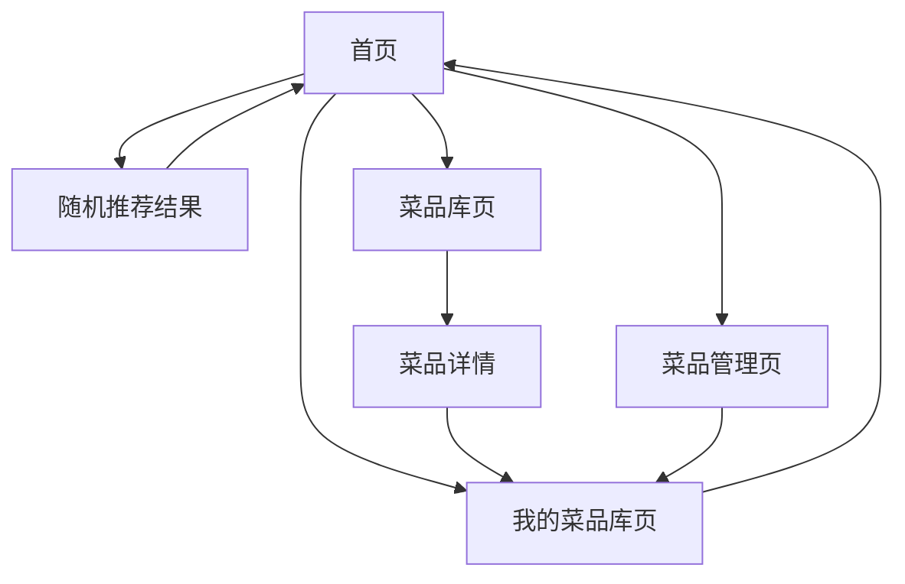

# 随机点菜系统产品需求文档

## 1. Product Overview
随机点菜系统是一个帮助用户解决"今天吃什么"难题的web应用，通过智能随机推荐让用户轻松决定用餐选择。
- 用户可以自定义菜品库，添加个人喜好的菜品，也可以从丰富的预设菜品库中选择，系统将智能随机推荐菜品。
- 产品旨在为有选择困难症的用户提供便捷的用餐决策工具，提升用餐体验的趣味性。

## 2. Core Features

### 2.1 User Roles
本产品采用单一用户角色设计，无需复杂的权限管理：

| Role | Registration Method | Core Permissions |
|------|---------------------|------------------|
| 普通用户 | 无需注册，直接使用 | 可添加菜品、管理个人菜品库、使用随机推荐功能 |

### 2.2 Feature Module
随机点菜系统包含以下核心页面：
1. **首页**：随机推荐展示区、快速操作按钮、菜品库概览
2. **菜品管理页**：自定义添加菜品、上传图片、编辑菜品信息
3. **菜品库页**：全量菜品浏览、分类筛选、添加到随机库
4. **我的菜品库页**：个人菜品库管理、移除菜品、查看详情

### 2.3 Page Details

| Page Name | Module Name | Feature description |
|-----------|-------------|---------------------|
| 首页 | 随机推荐区 | 显示随机推荐的菜品卡片，包含菜品图片、名称、简介，点击"再来一个"按钮重新随机 |
| 首页 | 快速操作区 | 提供"添加菜品"、"浏览菜品库"、"管理我的菜品"快捷入口按钮 |
| 首页 | 统计概览 | 显示当前个人菜品库数量、今日推荐次数等统计信息 |
| 菜品管理页 | 添加菜品表单 | 输入菜品名称、描述、分类，上传菜品图片，保存到个人菜品库 |
| 菜品管理页 | 图片上传组件 | 支持拖拽上传、预览图片、图片压缩处理 |
| 菜品库页 | 菜品列表展示 | 网格布局展示所有预设菜品，包含图片、名称、分类标签 |
| 菜品库页 | 分类筛选器 | 按菜系、口味、难度等维度筛选菜品 |
| 菜品库页 | 搜索功能 | 支持菜品名称关键词搜索 |
| 菜品库页 | 添加操作 | 点击菜品卡片上的"加入我的菜品库"按钮 |
| 我的菜品库页 | 个人菜品列表 | 展示用户添加的所有菜品，支持编辑和删除操作 |
| 我的菜品库页 | 批量管理 | 支持批量选择、删除菜品功能 |

## 3. Core Process

**主要用户操作流程：**

1. **首次使用流程**：用户进入首页 → 浏览预设菜品库 → 选择喜欢的菜品加入个人库 → 返回首页开始随机推荐

2. **日常使用流程**：用户进入首页 → 点击"随机推荐"获取菜品建议 → 满意则结束，不满意则继续随机

3. **菜品管理流程**：用户进入菜品管理页 → 填写菜品信息并上传图片 → 保存到个人菜品库 → 返回首页使用

## 4. User Interface Design

### 4.1 Design Style
- **主色调**：暖橙色(#FF6B35)作为主色，象征食物的温暖和美味
- **辅助色**：奶白色(#FFF8F0)背景，深棕色(#8B4513)文字，浅灰色(#F5F5F5)卡片
- **按钮风格**：圆角矩形按钮，带有轻微阴影和悬停动效
- **字体**：中文使用苹方或思源黑体，英文使用Roboto，主标题18px，正文14px
- **布局风格**：卡片式设计，网格布局，顶部导航栏固定
- **图标风格**：使用食物相关的线性图标，配合美食emoji增加趣味性🍽️🎲

### 4.2 Page Design Overview

| Page Name | Module Name | UI Elements |
|-----------|-------------|-------------|
| 首页 | 随机推荐区 | 大尺寸菜品卡片居中显示，圆角设计，阴影效果，暖橙色"再来一个"按钮带有轻微弹跳动画 |
| 首页 | 快速操作区 | 三个并排的圆角按钮，图标+文字组合，悬停时轻微放大效果 |
| 菜品管理页 | 添加表单 | 简洁的表单设计，输入框带有聚焦动效，上传区域采用虚线边框拖拽提示 |
| 菜品库页 | 菜品网格 | 3-4列响应式网格，每个菜品卡片包含图片、标题、标签，悬停时显示"添加"按钮 |
| 我的菜品库页 | 菜品列表 | 列表式布局，每行包含缩略图、菜品信息、操作按钮，支持滑动删除 |

### 4.3 Responsiveness
产品采用移动优先的响应式设计，在手机端优化触摸交互体验，支持手势操作如滑动删除、拖拽上传等。桌面端提供更丰富的悬停效果和快捷键支持。