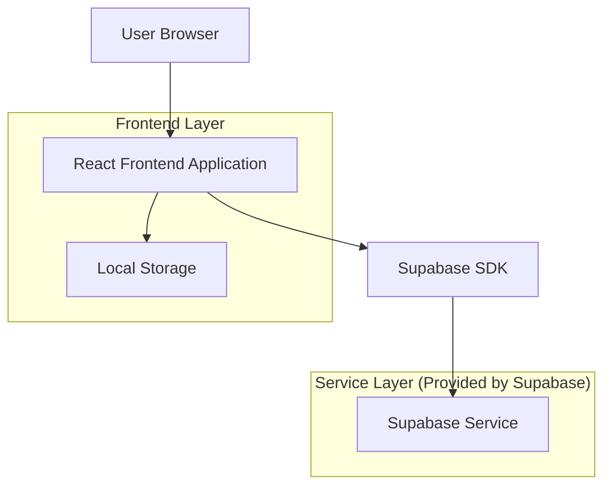
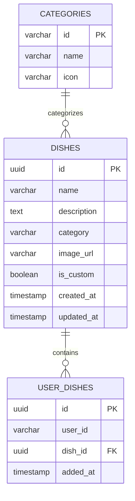

# 随机点菜系统技术架构文档

## 1. Architecture design



## 2. Technology Description

* Frontend: React\@18 + TypeScript\@5 + Vite\@5 + TailwindCSS\@3

* Backend: Supabase (PostgreSQL + Storage + Auth)

* State Management: Zustand\@4

* UI Components: Headless UI + Heroicons

* Image Processing: react-image-crop\@11

* Charts: Chart.js\@4 (for future analytics)

## 3. Route definitions

| Route      | Purpose            |
| ---------- | ------------------ |
| /          | 首页，显示随机推荐和快速操作入口   |
| /manage    | 菜品管理页，添加自定义菜品和上传图片 |
| /library   | 菜品库页，浏览和选择预设菜品     |
| /my-dishes | 我的菜品库页，管理个人菜品收藏    |
| /dish/:id  | 菜品详情页，查看单个菜品的详细信息  |

## 4. API definitions

### 4.1 Core API

菜品管理相关

```
GET /api/dishes
```

Response:

| Param Name | Param Type | Description |
| ---------- | ---------- | ----------- |
| dishes     | Dish\[]    | 菜品列表数组      |
| total      | number     | 菜品总数        |

```
POST /api/dishes
```

Request:

| Param Name  | Param Type | isRequired | Description |
| ----------- | ---------- | ---------- | ----------- |
| name        | string     | true       | 菜品名称        |
| description | string     | false      | 菜品描述        |
| category    | string     | true       | 菜品分类        |
| image\_url  | string     | false      | 菜品图片URL     |
| is\_custom  | boolean    | true       | 是否为用户自定义菜品  |

```
DELETE /api/dishes/:id
```

用户菜品库管理

```
GET /api/user-dishes
```

```
POST /api/user-dishes
```

Request:

| Param Name | Param Type | isRequired | Description |
| ---------- | ---------- | ---------- | ----------- |
| dish\_id   | string     | true       | 菜品ID        |
| user\_id   | string     | true       | 用户ID (本地存储) |

随机推荐

```
GET /api/random-dish
```

Response:

| Param Name | Param Type | Description |
| ---------- | ---------- | ----------- |
| dish       | Dish       | 随机推荐的菜品对象   |

### 4.2 Type Definitions

```typescript
interface Dish {
  id: string;
  name: string;
  description?: string;
  category: string;
  image_url?: string;
  is_custom: boolean;
  created_at: string;
  updated_at: string;
}

interface UserDish {
  id: string;
  user_id: string;
  dish_id: string;
  added_at: string;
  dish?: Dish;
}

interface Category {
  id: string;
  name: string;
  icon: string;
}
```

## 5. Data model

### 5.1 Data model definition



### 5.2 Data Definition Language

菜品表 (dishes)

```sql
-- create table
CREATE TABLE dishes (
    id UUID PRIMARY KEY DEFAULT gen_random_uuid(),
    name VARCHAR(100) NOT NULL,
    description TEXT,
    category VARCHAR(50) NOT NULL,
    image_url VARCHAR(500),
    is_custom BOOLEAN DEFAULT false,
    created_at TIMESTAMP WITH TIME ZONE DEFAULT NOW(),
    updated_at TIMESTAMP WITH TIME ZONE DEFAULT NOW()
);

-- create index
CREATE INDEX idx_dishes_category ON dishes(category);
CREATE INDEX idx_dishes_is_custom ON dishes(is_custom);
CREATE INDEX idx_dishes_created_at ON dishes(created_at DESC);

-- RLS policies
GRANT SELECT ON dishes TO anon;
GRANT ALL PRIVILEGES ON dishes TO authenticated;
```

用户菜品库表 (user\_dishes)

```sql
-- create table
CREATE TABLE user_dishes (
    id UUID PRIMARY KEY DEFAULT gen_random_uuid(),
    user_id VARCHAR(100) NOT NULL,
    dish_id UUID NOT NULL REFERENCES dishes(id) ON DELETE CASCADE,
    added_at TIMESTAMP WITH TIME ZONE DEFAULT NOW()
);

-- create index
CREATE INDEX idx_user_dishes_user_id ON user_dishes(user_id);
CREATE INDEX idx_user_dishes_dish_id ON user_dishes(dish_id);
CREATE UNIQUE INDEX idx_user_dishes_unique ON user_dishes(user_id, dish_id);

-- RLS policies
GRANT SELECT ON user_dishes TO anon;
GRANT ALL PRIVILEGES ON user_dishes TO authenticated;
```

分类表 (categories)

```sql
-- create table
CREATE TABLE categories (
    id VARCHAR(50) PRIMARY KEY,
    name VARCHAR(50) NOT NULL,
    icon VARCHAR(50) NOT NULL
);

-- init data
INSERT INTO categories (id, name, icon) VALUES
('chinese', '中式菜品', '🥢'),
('western', '西式菜品', '🍽️'),
('japanese', '日式菜品', '🍱'),
('korean', '韩式菜品', '🍲'),
('dessert', '甜品饮品', '🍰'),
('snack', '小食零食', '🍿'),
('hotpot', '火锅烧烤', '🍲'),
('noodles', '面食粉面', '🍜');

-- RLS policies
GRANT SELECT ON categories TO anon;
GRANT ALL PRIVILEGES ON categories TO authenticated;
```

预设菜品数据

```sql
-- init dishes data
INSERT INTO dishes (name, description, category, image_url, is_custom) VALUES
('宫保鸡丁', '经典川菜，鸡肉嫩滑，花生香脆', 'chinese', null, false),
('麻婆豆腐', '麻辣鲜香的经典川菜', 'chinese', null, false),
('糖醋里脊', '酸甜可口的家常菜', 'chinese', null, false),
('意大利面', '经典番茄肉酱意面', 'western', null, false),
('牛排', '煎制完美的西式牛排', 'western', null, false),
('寿司拼盘', '新鲜的日式寿司组合', 'japanese', null, false),
('拉面', '浓郁汤头的日式拉面', 'japanese', null, false),
('韩式炸鸡', '香脆可口的韩式炸鸡', 'korean', null, false),
('石锅拌饭', '营养丰富的韩式拌饭', 'korean', null, false),
('提拉米苏', '意式经典甜品', 'dessert', null, false),
('芝士蛋糕', '浓郁香甜的芝士蛋糕', 'dessert', null, false),
('薯条', '金黄酥脆的炸薯条', 'snack', null, false),
('爆米花', '香甜的爆米花', 'snack', null, false),
('麻辣火锅', '四川风味麻辣火锅', 'hotpot', null, false),
('烤肉', '韩式烤肉', 'hotpot', null, false),
('兰州拉面', '清汤牛肉面', 'noodles', null, false),
('意大利面条', '奶油蘑菇意面', 'noodles', null, false);
```

